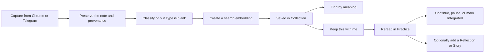

# Novah

Novah helps you keep ideas with their original context, find them by meaning, and return to them over time.

**Live app:** [Open Novah](https://novah-ten.vercel.app)

Novah is currently a private beta. You can create an account in the web app, but the Chrome extension still has to be built and loaded locally.

## What Novah does

You can save selected text, quotations, observations, and your own notes from a Chrome side panel. You can also send text or voice notes to a linked Telegram bot.

Novah keeps the original note and its provenance: optional personal context, source title, source URL, capture channel, and capture time. You can choose a Type yourself. If you leave Type blank, Novah classifies the note into one of seven supported Types: quote, argument, lesson, observation, reflection, principle, or conversation note.

Every new capture gets a search embedding for Find. It does not get an AI-generated summary, tags, or a per-note AI recall prompt. Find can write a grounded answer when the retrieved notes provide strong enough evidence; otherwise it returns possible matches without inventing an answer.

## The idea behind Novah

Novah takes inspiration from _hypomnēmata_, an old Greek practice of keeping quotations, observations, arguments, and principles for repeated reflection. The point was not simply to archive them. People returned to these notes until the ideas became part of how they thought.

Novah follows the same basic rhythm. You keep the wording and context that mattered, find the original note by meaning, or deliberately keep it in Practice until you decide it has become part of how you think or act.

## How the product works



The browser clients use Supabase authentication. Edge Functions handle classification, embeddings, grounded synthesis, voice transcription, Telegram requests, and scheduled delivery. Notes, Practice state, and append-only Reflection/Story entries live in Postgres with Row Level Security.

## Capture with the Chrome extension

For the hosted private beta:

1. Open the [live app](https://novah-ten.vercel.app) and create an account.
2. Get the two public browser configuration values through the beta invitation channel, then build and load the extension as described below. Public Chrome Web Store distribution is not complete.
3. Sign in to the extension with the same account.
4. Select text on a webpage, right-click, and choose **Save to Novah**. You can also open the side panel and start a note manually.
5. Open **Add details** if personal context, Type, source title, or source URL would help. These fields are optional.
6. Choose a Type, or leave **Let Novah decide** selected.
7. Save the note. If the request fails, the extension keeps the draft and its idempotency key locally so you can retry safely.
8. Choose **Done** to finish or **Keep this with me** to activate the note in Practice.
9. Use the extension's Find tab or the web Collection to search and browse.

The extension captures the page title and HTTP(S) URL when Chrome makes them available. Chrome PDF and internal pages may require you to paste the source URL yourself.

## Capture, Find, and Practice through Telegram

The beta bot is shared through the private invitation channel; the repository does not publish a bot handle.

1. Open Settings in the web dashboard and generate a link code.
2. Send `/link CODE` to the bot from a private Telegram chat within ten minutes. The code is single-use.
3. Send plain text or a voice note to save it. Forwarded text is also supported.
4. Use `/find QUERY` for semantic Find, `/practice` for active Practices, and `/settings` to read your timezone and Practice time. `/start` and `/help` show linking or command guidance.

Voice notes are limited to two minutes and 10 MiB. Novah downloads the file long enough to transcribe it, clears the in-memory audio, and saves the transcription as the note. Raw audio is not stored durably.

If you deploy Novah yourself, you must create your own Telegram bot, deploy a reachable webhook, configure its secret, and set the webhook's allowed update types. A local database reset does none of this for you.

## How Practice works

Saving a note does not schedule it. **Keep this with me** explicitly activates it, and each account can have at most three active Practices. The first activation uses a one-day interval; later activations remember the last interval you selected, from 1 through 30 whole calendar days.

Activation and resume first become due on the next calendar day in your account timezone. A due Practice stays due until you act. **Reread** is a complete encounter: the exact note is visible, there is no reveal step, and writing is optional. Completing an overdue encounter schedules the next one from today's local date rather than creating catch-up work.

Reflection and Story are separate append-only entry types. The full chronological thread and optional fixed prompt bank appear only in the note drawer. Practice cards never display prompt controls or entry content. Find continues to use original notes only; Practice writing is not embedded or supplied to synthesis.

Pausing frees an active slot and can be indefinite or use a resume date. A dated pause resumes automatically when a slot is available; otherwise it waits in **Ready to resume** without displacing another Practice. Marking a note **Integrated** also frees its slot and schedules a 30-day check-in. The user—not Novah—decides whether something is Integrated.

Telegram may notify once per local day while an active Practice remains due. The notification worker checks eligible schedules every ten minutes, sends active Practices separately, and groups due Integrated check-ins. Ignoring a notification does not create a missed event or advance a schedule.

## What is available in the web dashboard

- Practice is the signed-in landing page. It shows active-slot usage, due and upcoming Practices, Ready-to-resume pauses, and Integrated check-ins.
- Collection lets you browse Saved, Practising, Paused, and Integrated notes, run Find, filter by Type, open the full note drawer, export JSON or Markdown, and delete a note.
- Settings controls timezone and the account-level Practice time, creates Telegram link codes, shows connection state, and supports reauthenticated account deletion.
- Privacy explains the data and provider boundaries without requiring you to sign in.

Deleting a note also deletes its Practice state, events, entries, notification claims, and reply prompts. Account deletion removes all owned data. JSON and Markdown exports intentionally remain note-only and exclude Reflection and Story entries, so export first if you may want a copy of the note collection.

## Technology overview

- React 19, TypeScript, Vite 8, and Tailwind CSS 4 for the web dashboard
- WXT and Chrome Manifest V3 for the extension
- Supabase Auth, Postgres, pgvector, Edge Functions, and Cron for data and backend work
- OpenAI APIs for optional Type classification, original-note embeddings, grounded Find synthesis, and voice transcription
- Telegram Bot API for capture, Find, Practice notifications, replies, and lifecycle actions
- Vercel for the hosted web application
- Zod for shared request and response validation

## Run Novah locally

Install these prerequisites first:

- Node.js 20 or newer
- `pnpm` 10.33.2, the version declared in the root package
- Docker Desktop for local Supabase
- Git
- Chrome for the extension

From the repository root:

```bash
pnpm install --frozen-lockfile
cp .env.example .env
pnpm dev
```

Fill the ignored `.env` before starting. `pnpm dev` preserves that configured
Supabase project for Auth and database requests, starts Vite at
`http://127.0.0.1:5173`, and proxies only Edge Function requests through the
local Vite server using `APP_URL` as the allowed upstream origin so browser
CORS does not block them. Stop Vite with Ctrl+C.

To use the local Supabase stack instead of a configured hosted project, start
it, copy its public endpoint and key into `.env`, and reset its schema:

```bash
pnpm db:start
pnpm exec supabase status
pnpm db:reset
```

`pnpm db:reset` resets only the local Supabase database, replays every tracked migration, and loads the synthetic test seed. It does not change the hosted project.

The local Supabase commands do not create a complete hosted copy. Telegram
needs a public HTTPS webhook; Supabase Cron and hosted secrets are not created
by them.

## Environment variables

Keep real values in the ignored `.env` for local work. In production, store each value only where the table says.

| Variable                        | Used by                                                | Public or secret   | What you supply                                                        | Where to store it                                                                                              |
| ------------------------------- | ------------------------------------------------------ | ------------------ | ---------------------------------------------------------------------- | -------------------------------------------------------------------------------------------------------------- |
| `VITE_SUPABASE_URL`             | Web and extension                                      | Public             | Your Supabase API URL                                                  | Local `.env`; Vercel Production; extension build environment                                                   |
| `VITE_SUPABASE_PUBLISHABLE_KEY` | Web and extension                                      | Public             | Your Supabase publishable key                                          | Local `.env`; Vercel Production; extension build environment                                                   |
| `OPENAI_API_KEY`                | Edge Functions                                         | Secret             | A server-side OpenAI API key                                           | Local ignored environment for function work; Supabase Edge Function secrets in production                      |
| `TELEGRAM_BOT_TOKEN`            | Telegram and notification functions                    | Secret             | The token issued for your Telegram bot                                 | Local ignored environment; Supabase Edge Function secrets                                                      |
| `TELEGRAM_WEBHOOK_SECRET`       | Telegram webhook                                       | Secret             | A strong random webhook signing secret                                 | Local ignored environment; Supabase Edge Function secrets; matching Telegram webhook configuration             |
| `CRON_SECRET`                   | Notification endpoint and Cron                         | Secret             | A strong random Bearer secret                                          | Local ignored environment; Supabase Edge Function secrets; Supabase Vault for the scheduled job                |
| `APP_URL`                       | Edge Function CORS and Supabase Auth                   | Public origin      | The canonical HTTPS web origin for your deployment                     | Local ignored environment; Supabase Edge Function configuration; Supabase Auth site and redirect configuration |
| `ALLOWED_EXTENSION_IDS`         | Edge Function CORS                                     | Public identifiers | A comma-separated list of trusted Chrome extension IDs                 | Local ignored environment; Supabase Edge Function configuration                                                |
| `SUPABASE_URL`                  | Edge Functions                                         | Supabase-managed   | Supabase supplies the project API URL                                  | Supabase-managed Edge Function environment                                                                     |
| `SUPABASE_ANON_KEY`             | Edge Functions                                         | Managed public key | Supabase supplies it; functions use it as the publishable-key fallback | Supabase-managed Edge Function environment                                                                     |
| `SUPABASE_SERVICE_ROLE_KEY`     | Telegram, notification, and account-deletion functions | Secret             | Supabase supplies it                                                   | Supabase-managed Edge Function environment only                                                                |

Only the two `VITE_*` variables may enter the web and extension bundles. OpenAI, Telegram, webhook, Cron, and service-role secrets are server-only. Never commit `.env`, and never expose the service-role key through Vite or the extension. Do not put real secret values in documentation or build arguments that may be retained.

## Load the Chrome extension locally

Set the two public `VITE_*` values in the root `.env`, then build the production extension:

```bash
pnpm --filter extension build
```

The unpacked build appears at `apps/extension/.output/chrome-mv3`.

1. Open `chrome://extensions`.
2. Turn on **Developer mode**.
3. Choose **Load unpacked**.
4. Select `apps/extension/.output/chrome-mv3`.
5. Open Novah's side panel and sign in.

Chrome is the supported browser. Reload the extension from `chrome://extensions` after rebuilding it.

## Telegram and scheduled notifications

A developer deployment needs more than the browser environment:

1. Deploy the seven Supabase Edge Functions.
2. Set the OpenAI, Telegram, webhook, and Cron secrets in the Edge Function environment. Supabase supplies its managed URL and keys there.
3. Set `APP_URL` and `ALLOWED_EXTENSION_IDS` so browser CORS is explicit.
4. Configure Supabase Auth's site URL and allowed redirect URL for the deployed web origin.
5. Register the reachable `telegram-webhook` function with Telegram using the same webhook secret and only the supported message and callback update types.
6. Configure one `*/10 * * * *` Supabase Cron job that calls `process-notifications` with the matching `CRON_SECRET`.

The repository contains guarded deployment and verification scripts, but several are intentionally pinned to the current Novah project. Review and adapt them before using them for another deployment. Do not run hosted tests, configure Cron, set a webhook, or make provider calls unless you intend the external writes and cost.

## Portability warning

Copying `.env.example` is not enough to move the whole stack to a new Supabase or Vercel project. The current repository contains deployment-specific values in several places:

- `apps/web/src/lib/config.ts` accepts the current hosted Supabase origin or an explicit local origin.
- `apps/extension/lib/config.ts` accepts the current hosted Supabase origin and expects the current stable extension ID.
- `apps/extension/wxt.config.ts` contains the public manifest key and a Supabase host permission. A new key changes the extension ID.
- `vercel.json` limits browser connections through a Content Security Policy tied to the current Supabase origin.
- Supabase Auth uses `APP_URL` for its site and redirect URL, while Edge Function CORS uses `APP_URL` and `ALLOWED_EXTENSION_IDS`.

For your own deployment, replace these pins together: the Supabase origin, extension manifest key and ID, host permission, CSP connection origin, Auth redirect URL, and extension allowlist. Verify both the web origin and the final Chrome extension ID.

## Useful development and verification commands

```bash
# Local database and migrations
pnpm db:start
pnpm test:practice:upgrade
pnpm db:reset
pnpm db:test

# Browser applications
pnpm --filter web test
pnpm --filter web build
pnpm --filter extension test
pnpm --filter extension typecheck
pnpm --filter extension build

# Edge Functions and shared checks
pnpm test:functions
pnpm typecheck
pnpm lint
pnpm format:check

# Credential and retrieval fixture checks
pnpm test:security
pnpm test:retrieval:validate
```

The hosted, live Telegram, notification, and retrieval commands in `package.json` can create fixtures, send messages, or call paid providers. Read the runbook and obtain the necessary approval before running them.

## Privacy and security notes

Novah stores account details, original note text, optional personal context and source metadata, the assigned Type, embeddings, Practice state, append-only Practice entries and content-free lifecycle events, reply prompts, and delivery settings. Historical notes may still contain legacy summaries, tags, or recall prompts; new captures do not create them.

Row Level Security scopes user-owned records to the signed-in account. Browser clients receive only public Supabase configuration. Server-only calls handle model access, service-role database work, Telegram signing, and Cron authentication. Text-generation requests use `store: false`, and production application code does not log note or transcription content.

Telegram messages pass through Telegram infrastructure. OpenAI receives only the data needed for the requested classification, embedding, synthesis, or transcription operation. Novah does not use AI to choose prompts, judge Practice progress, or decide that a note is Integrated. It does not send note content to third-party analytics, sell it, or use it for advertising.

You can export your note collection as JSON or Markdown, delete individual notes, or permanently delete your account from Settings. Reflection and Story entries are intentionally excluded from exports and are erased by deleting their parent note or the account.

## Current limitations

Novah is a private beta. The Chrome extension is not publicly distributed through the Chrome Web Store yet, so testers load an unpacked build. Chrome is the only supported browser.

Native mobile apps, public sharing, collaboration, payments, subscriptions, adaptive Practice scheduling, and support for Firefox, Safari, or Edge are not implemented. The web dashboard does not capture notes directly; capture currently happens through the Chrome extension or Telegram. Running the full stack under a new account also requires replacing the deployment-specific configuration described above.
